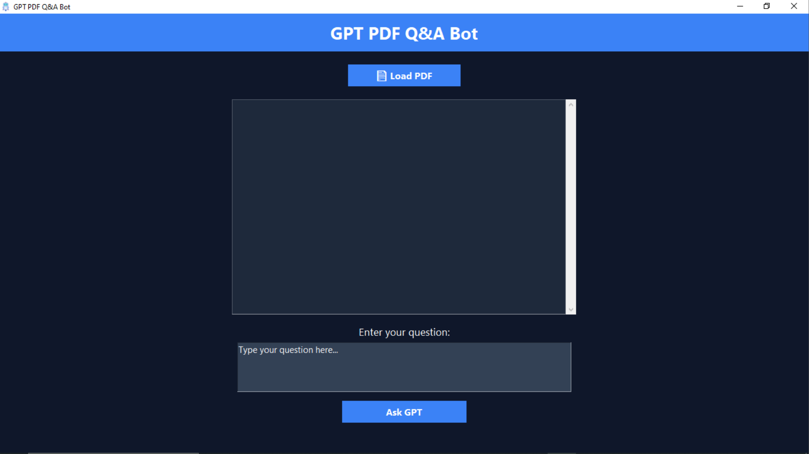
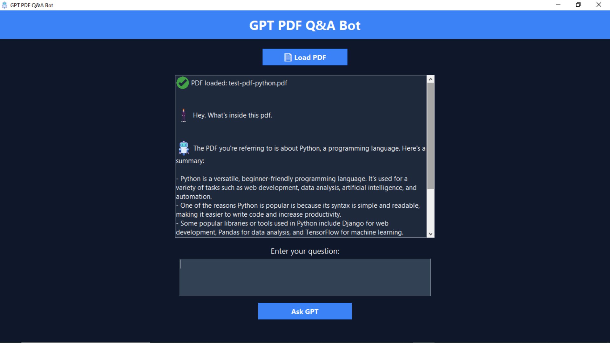

# 🧠 PDFQnABot

An AI powered desktop chatbot with optional PDF Q&A. Built in Python using Tkinter and OpenRouter API (Mistral model).  
Use it like ChatGPT or upload a PDF to ask questions based on its content.

---

## ✨ Features

- **Chat Freely**  
  Ask anything and get instant AI responses (ChatGPT-style).

- **PDF Q&A**  
  Upload a PDF — the bot will answer questions based on the document’s content.

- **User-Friendly UI**  
  Smooth, responsive interface built with Tkinter.

- **Powered by Mistral (OpenRouter API)**  
  Enjoy fast and accurate replies from a leading LLM model.

- **Lightweight & Offline-Friendly**  
  No bloated dependencies — easy to run on most systems.

---

## 🔧 Tech Stack

- **Language:** Python 3  
- **Libraries:** Tkinter, Requests, PyMuPDF, Python-Dotenv  
- **AI Model:** Mistral via [OpenRouter API](https://openrouter.ai)

---

## 📸 Screenshots

**App Startup**  

**Chat with PDF**  

---
## 🎥 Demo Walkthrough

You can find the full app walkthrough video in the `assets` folder:  
📁 `assets/demo_walkthrough.mp4`  
*Note: The video will download when clicked since GitHub does not stream `.mp4` files directly.*

---
## 🧪 Want to Try It?

A `.exe` version is available on request.  
[Contact me on Fiverr](https://fiverr.com/ayaan_nadeemdev) for demo access or custom builds.

---

## 🚀 Need Something Similar?

Want a personalized AI bot or custom desktop Python app?  
Check out my gig 👇  
🔗 [I will build your custom Python desktop app](https://www.fiverr.com/s/yv6Dj16)

---

## 📝 Note

This is a **demo showcase only** — source code is not included in this repository.  
For code access or collaboration, feel free to reach out.

---

##  License

**Demo Only** — All rights reserved.
